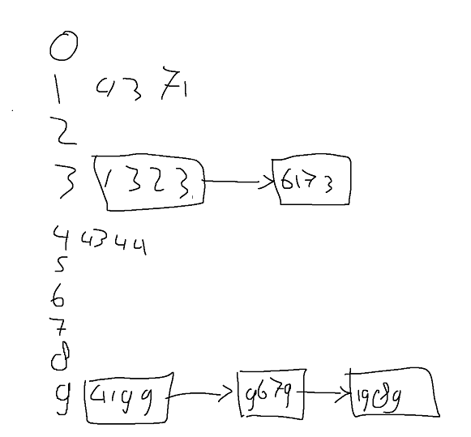

20.2 
- 11, because it is a primer number.

20.3
- Probing (linear and quadratic): lazy deletion 
- Separate chaining: deletion like in a linked list

20.5
a. 

b. 

c. 

20.6
- Table size is 10, so 10*2 = 20.
- Closest prime number to 20 = 23. So size should be 23.

